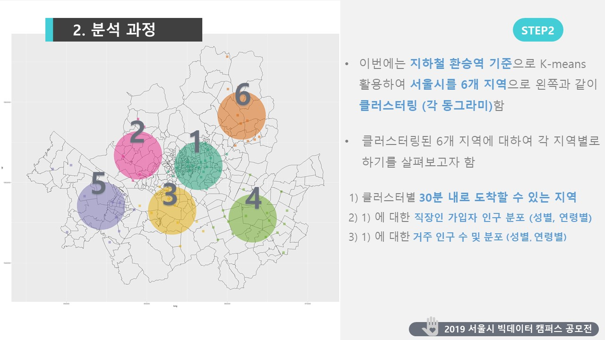

# 비영리 단체를 위한 최적의 모임 & 행사 위치 찾기

'비영리 단체를 위한 최적의 모임 & 행사 위치 찾기'을 주제로 데이터분석을 하여, '서울 빅데이터 캠퍼스 공모전 2019 하반기'에 제출 했지만, 입상은 하지 못했습니다.

이후에 같은 공모전에 출품하시는 분들에게 참고 자료가 되었으면 합니다. ;)

## 분석 배경
- 비영리 단체들이 자원 봉사를 위한 모임/행사를 연다고 할 때, 회사원들의 퇴근 후 참여를 기대 하지만,
- 실제로 높은 참석율을 이끌어내기가 어려운 실정
- 어떻게 하면 더 많은 사람들이 참여를 할 수 있도록 유도 할 수 있을까? 
- 데이터 분석을 통해 최적의 모임 장소 위치를 도출하여 
- 더 많은 사람들이 참석할 수 있는 곳에서 모임/행사를 열 수 있도록 돕는다.

## 분석 과정
- 거주인구, 직장인 동별 인구 기반으로 인구의 동별 밀집도 분석
- 지하철 환승역 기준으로 지역을 클러스터링 함
- 각 클러스터별로, 퇴근 후 이동해 자원봉사에 참여할 수 있는 사람을, 직장인구수, 거주 인구수, 성별, 연령별 분석
- 클러스터별로 분석결과 비교및 보다 좋은 클러스터 추천

# 데이터셋 및 도구

R과 Excel을 사용해서 분석했습니다.

| 데이터셋명 | 제공기관 | 비고 |
| ----- | ----- | ----- |
|거주인구 데이터|서울특별시 빅데이터 캠퍼스|https://bigdata.seoul.go.kr|
|직장인 동 별 인구수|국민연금 가입 통계정보제공 서비스|https://www.data.go.kr|
|구글 Distance Matrix API|Google LLC|https://developers.google.com/maps/documentation/distance-matrix/intro|
|서울시 지도|행정안전부 산하 한국지역정보개발원|http://www.juso.go.kr|
|지하철 환승역 위치|행정안전부 산하 한국지역정보개발원|http://www.juso.go.kr|

# 참고자료
- ‘국민연금 가입현황’ OpenAPI 사용하기
 - https://github.com/skysign/example_korea_NPS_openapi
- R에서 한국지도 그려보기 (Drawing South Korea map in R)
 - https://github.com/skysign/drawing_south_korea_map_in_R
- R에서 구글 Distan Matrix API는 다른 OpenAPI를 사용기
 - https://github.com/skysign/example_google_distance_matrix_api_in_R

# 저작권 & License
- 분석에 사용된 OpenAPI 및 모든 데이터는, 제공해주시는 기관및 단체의, 라이센스및 저작권을 따릅니다.
- 분석에 사용된 R 코드만 포함되어 있으며, 데이터는 포함되어 있지 않습니다.
